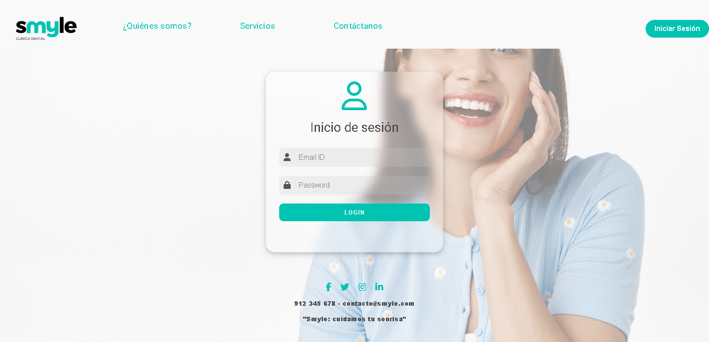
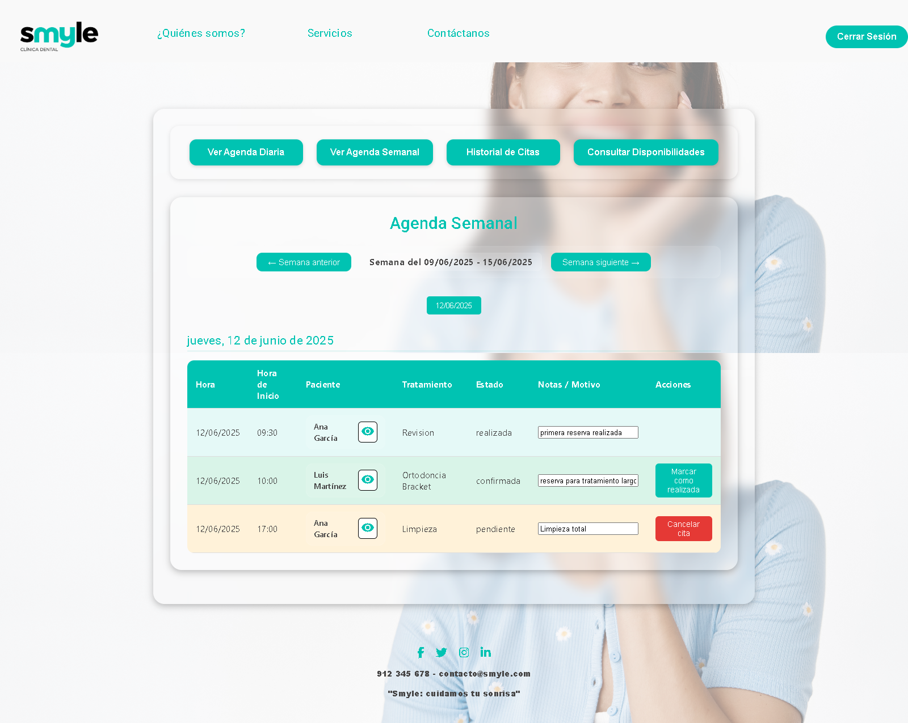

# 🦷 Clínica Dental - Frontend


Este es el frontend del sistema de gestión de una clínica dental. Desarrollado con **Angular 17**, se conecta con el backend NestJS para ofrecer funcionalidades como gestión de citas, pacientes, profesionales, disponibilidades y autenticación con JWT.

---

## 🚀 Tecnologías principales

- [Angular 17](https://angular.io/)
- [RxJS](https://rxjs.dev/)
- [TypeScript](https://www.typescriptlang.org/)
- CSS nativo para estilos
- JWT para autenticación y control de roles
- `localStorage` para persistencia de sesión

---

## ⚙️ Requisitos del sistema

- Node.js: `v20.11.0`
- npm: `10.2.4`
- Angular CLI: `17.3.17`

---

## ▶️ Instalación y ejecución

```bash
git clone https://github.com/fran-eliot/dental-front.git
cd dental-front
npm install
ng serve -o
```

La aplicación se abrirá automáticamente en:
📍 http://localhost:4200

---

## 📁 Estructura de carpetas

```plaintext
src/
├── app/
│   ├── appointments/
│   │   ├── historical-appointments/
│   │   └── new-appointments/
│   ├── dentistas/
│   │   ├── consulta-disponibilidades-dentista/
│   │   ├── dentista-dashboard/
│   │   ├── dentista-agenda-diaria/
│   │   ├── dentista-agenda-semanal/
│   │   ├── dentista-layout/
│   │   ├── historial-citas-dentista/
│   │   ├── historial-citas-paciente/
│   │   └── historial-citas-paciente-modal/
│   ├── disponibilidades/
│   │   ├── consulta-disponibilidades/
│   │   ├── consulta-preview/
│   │   ├── disponibilidades-mensuales/
│   │   ├── generador-disponibilidades/
│   │   ├── limpieza-disponibilidades/
│   │   ├── lista-disponibilidades/
│   │   ├── selector-disponibilidades/
│   │   ├── slots-libres/
│   │   └── slots-libres-preview/
│   ├── login/
│   ├── patients/
│   ├── professionals/
│   ├── register-user/
│   ├── treatments/
│   ├── unauthorized/
│   └── users/
```

---

## 🔐 Autenticación

- La autenticación se gestiona mediante JWT:

- Al iniciar sesión correctamente, el token se guarda en localStorage.

- El token se incluye automáticamente en los headers de las peticiones HTTP mediante interceptores.

    Authorization: Bearer <jwt_token>

- El sistema protege rutas según roles: admin, dentista (futura mejora: paciente).


---

## 🌐 Comunicación con Backend

- El frontend se comunica con el backend NestJS a través de servicios Angular personalizados.

- Todos los endpoints utilizan peticiones HTTP estándar (GET, POST, PATCH, DELETE) y consumen las rutas expuestas en el backend.

- El repositorio del backend está disponible aquí:
    👉 Clínica Dental - Backend (NestJS): https://github.com/fran-eliot/dental-back

- Los endpoints están documentados vía Swagger en el backend:
    📌 http://localhost:3000/api

---

## 🎨 Estilos

- Se utiliza CSS nativo (no SCSS, Tailwind ni Bootstrap).

- Existe una hoja de estilo base compartida (custom-theme.scss) para mantener consistencia visual entre componentes:

    - Fondo semitransparente

    - Bordes redondeados y sombras suaves

    - Colores definidos por variables :root

- Estética moderna, limpia y orientada a usabilidad para personal clínico y administrativo.

---

## 🧩 Componentes clave

# 📅 Appointments

- historical-appointments

- new-appointments

# 🧑‍⚕️ Dentistas

- consulta-disponibilidades-dentista

- dentista-dashboard

- dentista-agenda-diaria

- dentista-agenda-semanal

- dentista-layout

- historial-citas-dentista

- historial-citas-paciente

- historial-citas-paciente-modal

# 📆 Disponibilidades

- consulta-disponibilidades

- consulta-preview

- disponibilidades-mensuales

- generador-disponibilidades

- limpieza-disponibilidades

- lista-disponibilidades

- selector-disponibilidades

- slots-libres

- slots-libres-preview

# 👤 Usuarios y otros

- login

- patients

- professionals

- register-user

- treatments

- unauthorized

- users

---

# 🖼️ Capturas  de pantallas

| Pantalla                                                     | Descripción                         |
| ------------------------------------------------------------ | ----------------------------------- |
|                        | Pantalla de acceso al sistema       |
|      | Agenda semanal de un dentista       |
|  | Lista de disponibilidades semanales |
|              | Creación de una nueva cita          |
|                | Historial de citas de un paciente   |


## 🧑‍💻 Autores

Este proyecto ha sido desarrollado como parte de un sistema completo de gestión de una clínica dental, para el curso "Desarrollo Frontend con Angular" de Fundación Adecco.

Los autores del proyecto son:
- [Ainhoa Alonso](https://github.com/AinhoaAlonso)
- [Fran Ramírez](https://github.com/fran-eliot)
- [Asusalin Abou](https://github.com/asusalin)
